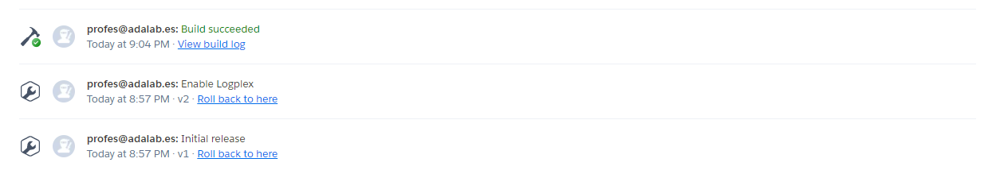

# ¿Cómo desplegar este repo en Heroku?

## ¿Cómo funciona Heroku?

Cuando creas una cuenta en **Heroku**, este se conecta con uno de tus repos de **GitHub** y cada vez que haces un push a la rama master, Heroku levanta un servidor con el código que haya en ese repositorio.

## Pasos a seguir para crear un servidor en Heroku

Estos son los pasos a seguir para publicar este repositorio en un servidor de producción de [Heroku](https://heroku.com).

1. Registrarse en heroku.com:
   1. Confirmar email.
   1. Acerptar terminos del servicio.
1. Crear una aplicación:
   1. Al pulsar en **Create new app**, hay que elegir:
      1. **Nombre de la aplicación.** No puede existir otro igual, ni si quiera que lo haya usado otra usuaria.
      1. **Choose a region:** Europe.
   1. En la pestaña **Deploy**, hay que elegir:
      1. **Deployment method.**
      1. **GitHub. Connect to GitHub > Hacer login.**
      1. Elegir repo **tshirt-eshop-heroku**, o tu propio repositorio.
      1. Pulsa en **Conectar**.
      1. En el apartado **Automatic deploys** pulsar en **Enabled automatic deploys**:
         - Con esto hacemos que cada vez que se suba algo a la master de tu repo, se despliegue automáticamente la nueva versión en el servidor de Heroku.
      1. Forzamos un despliegue pulsando **Deploy branch** en el apartado **Manual deploy**:
         - Con esto hacemos un despliegue manual, el primero.

## ¿Cómo ver el estado de mi aplicación?

Para saber cuál es el commit de tu repo que está desplegado y funcionando en tu Heroku pulsa en la pestaña **Activity**. En esta pestaña también puedes ver si ha **terminado de desplegarse** o **todavía se está desplegando** un commit.

## ¿Cómo abrir mi aplicación en la web?

Desde el panel de control de Heroku, pulsar en el botón **Open app**.

## ¿Cómo ver los console.log() de mi servidor?

Pulsando en el botón **More** > **View logs** podemos ver los `console.log()` que hayamos puesto en el código de nuestro servidor.

## Importante: puerto en el que arrancamos nuestro servidor

- El puerto que usamos normalmente cuando programamos en `localhost` es el `3000`.
- Heroku va a desplegar nuestro servidor en el puerto que Heroku quiera.
- Por ello Heroku nos indica el puerto que va a usar por la variable `process.env.PORT`.
- Por ello en `server/src/index.js` debemos poner la línea `const serverPort = process.env.PORT || 3000;` para calcular el puerto a usar.

## Sobre este repo

- Este repo tiene en la raíz un [`package.json`](./package.json), que ejecuta tareas de [`server/package.json`](server/package.json) y [`web/package.json`](web/package.json).
- Este repo tiene dentro dos proyectos internos que son [`server/`](server/) y [`web/`](web/).
- Para instalar las dependencias, ejecuta `npm install`.
- Para arrancar el servidor en modo desarrollo, ejecuta `npm run dev`.
- Para ejecutar el servidor en modo producción, ejecuta `npm start`.

## Patrones de diseño

El patrón de diseño de este servidor es:

